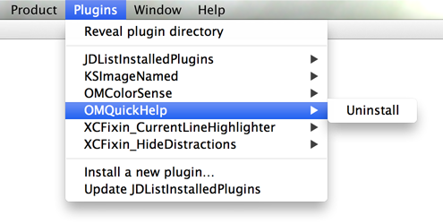
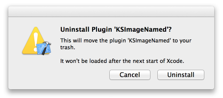
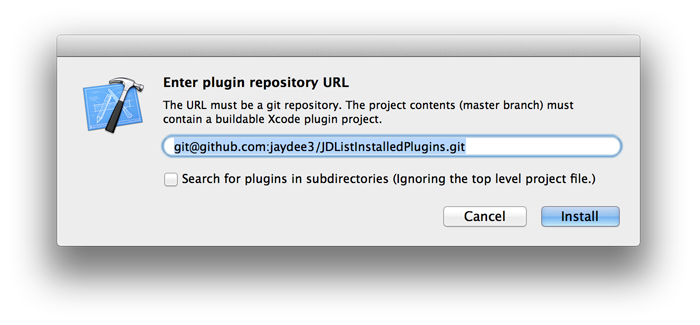

# JDPluginManager

## Overview

Are you using a lot of XCode Plugins?  
This plugin makes it easy to install, update and remove them. It adds a new MenuItem `Plugins` in the Menu Bar of Xcode, as you can see in the screenshots.

**Key Features:**

- Install plugins easily by just entering a git repository url
- One-click updates (for plugins installed with JDPluginManager)
- Uninstall plugins

**Screenshots:**

## Installation

Simply build this Xcode project once and restart Xcode. You can delete the project afterwards. (The plugin will be copied to your system automatically after the build.)

If you get a "Permission Denied" error while building, please see [this issue](https://github.com/omz/ColorSense-for-Xcode/issues/1) of the great [ColorSense plugin](https://github.com/omz/ColorSense-for-Xcode/).

## Uninstall

In Xcode, go to *Plugins > JDPluginManager > Uninstall* and restart Xcode afterwards.

## Twitter

I'm [@jaydee3](http://twitter.com/jaydee3) on Twitter. Please [tweet](https://twitter.com/intent/tweet?button_hashtag=JDPluginManager&text=This%20plugin%20manages%20Xcode%20plugins!%20Easy%20installing%20and%20uninstalling%20for%20plugins!%20https%3A%2F%2Fgithub.com%2Fjaydee3%2FJDPluginManager&via=jaydee3) about the plugin. 