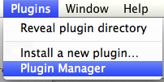
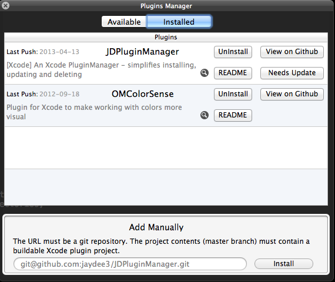
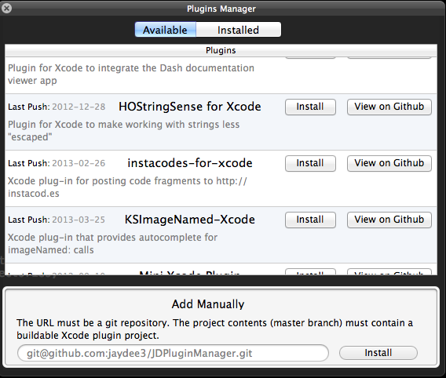
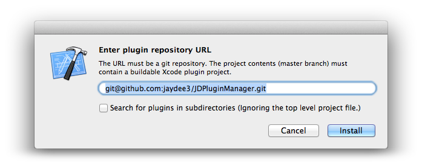

# JDPluginManager

## Overview

Are you using a lot of XCode Plugins?  
This plugin makes it easy to install, update and remove them. It adds a new MenuItem `Plugins` in the Menu Bar of Xcode, as you can see in the screenshots.

**Key Features:**

- Discover new plugins
- Install plugins easily by just entering a git repository url
- One-click updates (for plugins installed with JDPluginManager)
- Uninstall plugins


*This is tested on OS X 10.8 with Xcode 4.6 only, but probably runs also in older environments.*

**Screenshots:**  
Launch the manager from the menu:  
  
Manage Installed Plugins and be notified on avialable plugin updates:  
  
Discover new Xcode Plugins:  
  
Manually install Plugin:  
  
Uninstalling is just as easy:  


## Installation

Simply build this Xcode project once and restart Xcode. You can delete the project afterwards. (The plugin will be copied to your system automatically after the build.)

If you get a "Permission Denied" error while building, please see [this issue](https://github.com/omz/ColorSense-for-Xcode/issues/1) of the great [ColorSense plugin](https://github.com/omz/ColorSense-for-Xcode/).


## Uninstall

In Xcode, go to *Plugins > JDPluginManager > Uninstall* and restart Xcode afterwards.

## Plugin Developers:
To get listed in the available plugins list:  
1.  Fork the JDPluginManager: https://github.com/dannyshmueli/JDPluginManager  
2. Add your Xcode plugin to `plugins.json`:  
  ```{"title": "OMColorSense", "git": "git@github.com:omz/ColorSense-for-Xcode.git"}```  
  Please add it in alphabetical order to help prevent conflicts.  
3.  Send a pull request.

## Twitter

I'm [@jaydee3](http://twitter.com/jaydee3) on Twitter.  
Feel free to [post a tweet](https://twitter.com/intent/tweet?button_hashtag=JDPluginManager&text=This%20plugin%20manages%20Xcode%20plugins!%20Easy%20installing%20and%20uninstalling%20for%20plugins!%20https%3A%2F%2Fgithub.com%2Fjaydee3%2FJDPluginManager&via=jaydee3), if you like this plugin.  

[](https://twitter.com/intent/tweet?button_hashtag=JDPluginManager&text=This%20plugin%20manages%20Xcode%20plugins!%20Easy%20installing%20and%20uninstalling%20for%20plugins!%20https%3A%2F%2Fgithub.com%2Fjaydee3%2FJDPluginManager&via=jaydee3)

