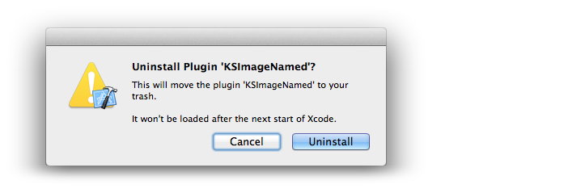

# JDListInstalledPlugins

## Overview

Are you using a lot of XCode Plugins?

This plugin will give you an overview of all installed Plugins. With it you can easily open their directories, or delete them right out of Xcode.  
*This is tested only on OS X 10.8 with Xcode 4.6.*

It adds a new MenuItem "Manage Plugins" in the Edit Menu of Xcode:

### Twitter

I'm [@jaydee3](http://twitter.com/jaydee3) on Twitter.  
Feel free to [post a tweet](https://twitter.com/intent/tweet?button_hashtag=JDListInstalledPlugins&text=This%20plugin%20manages%20Xcode%20plugins!%20Easy%20installing%20and%20uninstalling%20for%20plugins!%20https%3A%2F%2Fgithub.com%2Fjaydee3%2FJDListInstalledPlugins&via=jaydee3), if you like this plugin.  

## Installation

Simply build this Xcode project once and restart Xcode. You can delete the project afterwards. (The plugin will be copied to your system automatically after the build.)

If you get a "Permission Denied" error while building, please see [this issue](https://github.com/omz/ColorSense-for-Xcode/issues/1) from the great [ColorSense plugin](https://github.com/omz/ColorSense-for-Xcode/).

## Uninstall

In Xcode, go to *Edit > Manage Plugins > JDListInstalledPlugins > Uninstall*.

